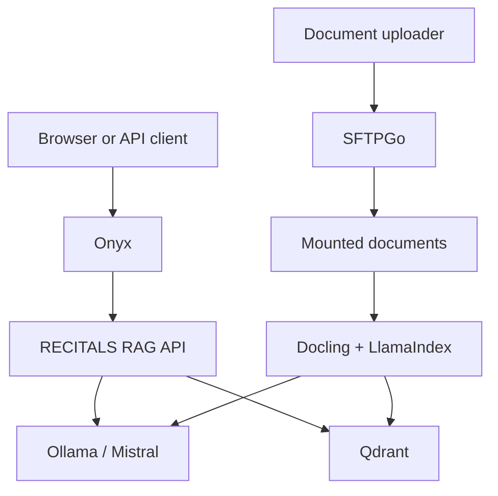

# RECITALS LLM Component

This repository contains the RECITALS proof-of-concept (PoC) deployment for
document-grounded conversational inference. It uses Onyx as the user interface,
a custom OpenAI-compatible RAG API for retrieval and response generation, and
Ollama for local GPU inference.


## Current status

| Capability | Status |
| --- | --- |
| Onyx browser chat | Implemented and validated |
| Programmatic Onyx chat using a user PAT | Implemented and validated |
| OpenAI-compatible `recitals-rag` endpoint | Implemented and validated |
| DOCX, Markdown and text ingestion | Implemented and validated |
| SFTPGo browser upload portal | Implemented and validated for the PoC |
| LlamaIndex retrieval and grounded context | Implemented and validated |
| Qdrant vector storage and source metadata | Implemented and validated |
| Ollama generation and embedding models | Implemented and validated |


The PoC was validated with two uploaded DOCX files. A grounded question returned
the expected answer through both the RAG API and Onyx, with a deduplicated source
citation.

## Architecture



The services share the external Docker network `ainet`. On the verified GCP
deployment, Onyx, SFTPGo, the RAG API and Qdrant run on the general-services VM.
Ollama runs on the dedicated NVIDIA L4 GPU VM and is reached over the private
network.

## Components

- `onyx/`: Onyx v4.0.0 Compose deployment and RECITALS Lite override.
- `rag_stack/`: FastAPI RAG service, ingestion command, Qdrant and SFTPGo.
- `ollama/`: NVIDIA GPU Compose configuration for generation and embeddings.
- Docling: extracts content from uploaded DOCX documents.
- LlamaIndex: chunks documents, creates retrieval queries and builds grounded
  context.
- Qdrant: stores document chunks, 1024-dimensional embeddings and source
  metadata.

The logical model name `recitals-rag` is the API model identifier exposed to
Onyx. Reindexing does not create a new Ollama model: document embeddings are
stored in Qdrant, while `mistral:7b-instruct` remains the generation model.

## Repository layout

```text
.
├── ollama/
│   └── docker-compose.yaml
├── onyx/
│   ├── README.md
│   ├── data/nginx/
│   └── deployment/
│       ├── docker-compose.yml
│       ├── docker-compose.recitals-lite.yml
│       └── docker-compose.network.yml
└── rag_stack/
    ├── app/
    │   ├── ingest.py
    │   └── main.py
    ├── Dockerfile
    ├── docker-compose.yml
    └── requirements.txt
```

SFTPGo configuration, its database and uploaded documents are runtime data and
must not be committed. They are ignored under `rag_stack/sftpgo/config/` and
`rag_stack/sftpgo/storage/`.

## Prerequisites

- Docker Engine and Docker Compose.
- A shared Docker network named `ainet`.
- A trusted Ollama host reachable from the general-services VM.
- `mistral:7b-instruct` and `mxbai-embed-large:v1` pulled in Ollama.

Create the shared network once:

```bash
docker network create ainet 2>/dev/null || true
```

If Docker socket access is restricted for the current account, prefix Docker
commands with `sudo`.

## Configure the RAG stack

Create `rag_stack/.env` with deployment-specific values. Do not commit it.

```env
QDRANT_IMAGE_TAG=v1.18.1
QDRANT_API_KEY=<random-secret>
QDRANT_COLLECTION=recitals_documents

OLLAMA_BASE_URL=http://<ollama-private-ip>:11434
OLLAMA_CHAT_MODEL=mistral:7b-instruct
OLLAMA_EMBED_MODEL=mxbai-embed-large:v1

RAG_API_KEY=<different-random-secret>
RECITALS_MODEL_ID=recitals-rag

CHUNK_SIZE=400
CHUNK_OVERLAP=50
RETRIEVAL_TOP_K=5
```

Generate independent API keys, for example with `openssl rand -hex 32`.

## Start the services

Start the RAG API, Qdrant and SFTPGo on the general-services VM:

```bash
docker compose -f rag_stack/docker-compose.yml up -d --build
```

Start Ollama on the GPU VM:

```bash
docker compose -f ollama/docker-compose.yaml up -d
docker exec ollama ollama pull mistral:7b-instruct
docker exec ollama ollama pull mxbai-embed-large:v1
```

Verify the general-services stack:

```bash
curl -fsS http://127.0.0.1:8010/health
curl -fsS http://127.0.0.1:8010/ready
curl -fsS http://127.0.0.1:6333/healthz
```

## Document upload and ingestion

For the PoC, controlled users upload documents through the SFTPGo WebClient.
SFTPGo writes user files below `rag_stack/sftpgo/storage/data/`; the RAG API
mounts that directory read-only at `/app/documents`.

The ingestion command accepts a single file or recursively processes a directory.
Supported file types are `.docx`, `.md`, `.markdown` and `.txt`; the default
maximum file size is 25 MiB. Unsupported files and failed conversions make the
batch return a non-zero status.

Run the current manual reindex after documents are uploaded:

```bash
docker exec recitals-rag-api \
  python -m app.ingest /app/documents/recitals-ingest
```

Each document is parsed, chunked and embedded using
`mxbai-embed-large:v1`. Existing Qdrant points with the same stable document ID
are removed before the replacement chunks are inserted.

Automatic upload-triggered indexing, unchanged-file skipping, deletion
reconciliation and failure alerting are intentionally deferred to the MVP.

## Configure Onyx

Start Onyx with the RECITALS Lite and network overrides:

```bash
cd onyx/deployment
docker compose \
  -f docker-compose.yml \
  -f docker-compose.recitals-lite.yml \
  -f docker-compose.network.yml \
  up -d
```

Configure an OpenAI-compatible model provider in Onyx:

```text
Base URL: http://recitals-rag-api:8000/v1
API key:  <RAG_API_KEY>
Model:    recitals-rag
```

The RECITALS RAG API deliberately ignores tool definitions supplied by Onyx;
the PoC remains a retrieval-and-generation workflow, not an agentic one.

## Programmatic Onyx access

Onyx Community does not provide service accounts. For PoC testing, a user can
create a short-lived personal access token (PAT) and call the Onyx chat API with
that user's permissions.

Do not send a PAT over plaintext public HTTP. Use HTTPS or an SSH tunnel and set
`ONYX_URL` to the protected endpoint.

```bash
read -rsp 'Onyx PAT: ' ONYX_PAT
printf '\n'

curl -fsS --max-time 300 \
  "${ONYX_URL}/api/chat/send-chat-message" \
  -H "Authorization: Bearer ${ONYX_PAT}" \
  -H 'Content-Type: application/json' \
  -d '{
    "message": "Which partner is responsible for the LLM component?",
    "chat_session_info": {"persona_id": 0},
    "llm_override": {
      "model_provider": "openai_compatible",
      "model_version": "recitals-rag",
      "temperature": 0
    },
    "allowed_tool_ids": [],
    "file_descriptors": [],
    "stream": false,
    "include_citations": true,
    "origin": "api"
  }'

unset ONYX_PAT
```

## Network exposure and PoC limitations

- Qdrant is bound to host loopback at `127.0.0.1:6333` and also uses an API key.
- The RAG API is bound to host loopback at `127.0.0.1:8010`; Onyx reaches it on
  `ainet` as `http://recitals-rag-api:8000`.
- SFTPGo currently publishes its WebClient on host port `3000` for the PoC.


